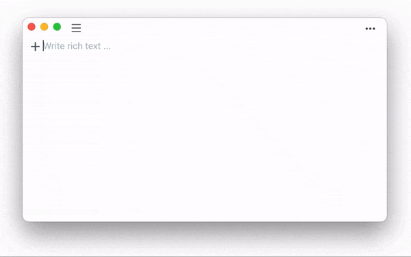
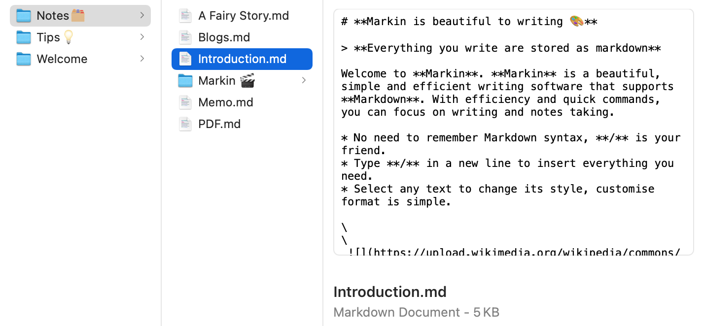
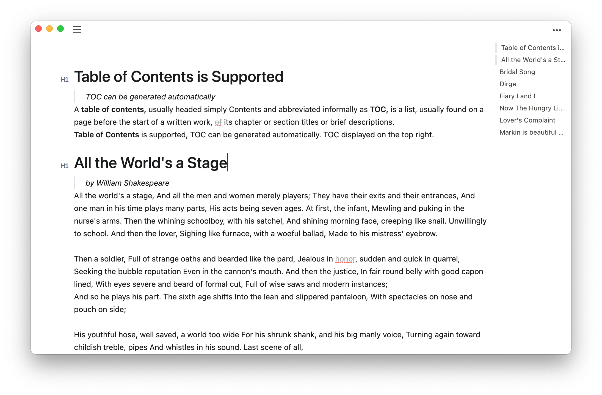

# User Guide

***

## Markin supports Markdown 🎨

> Everything you write are stored as markdown

**Markin** is a beautiful, simple and efficient writing software that supports [Markdown](https://www.markdownguide.org/).

* No need to remember Markdown syntax, **/** is your friend.
* Type **/** in a new line to insert everything you need.
* Select any text to change its style, customise format is simple.

## Stored on your computer
Files that you create in **Markin** are stored on your Mac. It's safe and controlled on your own. To open it, right-click on the file or folder you want to open in **Markin** and click `Reveal in Finder`

## Workspace 🪐

:::
The **Workspace** panel in the left column is the area to manage documents, where you can create, delete, and so on.
:::

* **To create files or folder in the specified directory**. Simply select the destination directory and click the New Document or Folder button.
* **To create files or folders at the top level of Workspace**. You need to first click WORKSPACE or the blank area in the left panel. The blue border that appears around left panel indicates that Workspace is selected. Click the New File or Folder button at this point to create a file or folder directly under Workspace.
* **More actions with Right-click.** Right-click on a file or folder and you will see more actions.

## Toolbar 🛠

:::
Using the ••• button in the upper right corner to open the toolbar.
:::

* Text - Adjust font size
* TOC - Open and close the content list
* Theme - Light or Dark
* Export - Export as PDF, HTML or Markdown

## Table of contents

## Emoji😀

`shift+command+space` or Edit > Emoji & Symbols

## Page break

Insert a Page break with `/` to split the Page when exporting as PDF.

***

## Drag and drop

You can drag and drop files from a folder to another.

## Open file or folder in local file-system

Files that you create in **Markin** are stored on your Mac. To open it, right-click on the file or folder you want to open in **Markin** and click `Reveal in Finder`.

You can operate **Markin** stored files like any other files on your local disk, such as backup, uploading to iCloud, web disk, etc.

## Import file into Markin

Files that you create in **Markin** are stored on your Mac, and **Markin** read files locally. After opening your local directory with `Reveal in Finder`, move the files into the directory, **Markin** can read them automatically.

:::
**Markin** just support Markdown files (.md)
:::

## Sync to iCloud

Files that you create in **Markin** are stored on your Mac, and they are stored as Markdown (.md).

You are free to sync these files into iCloud. If you don't know how to use iCloud, please read Apple's iCloud documentation.

[Home](./)